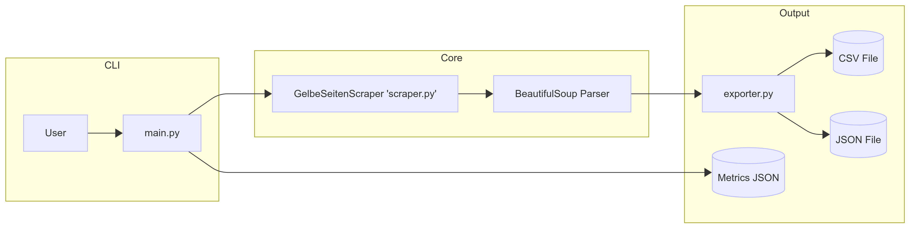
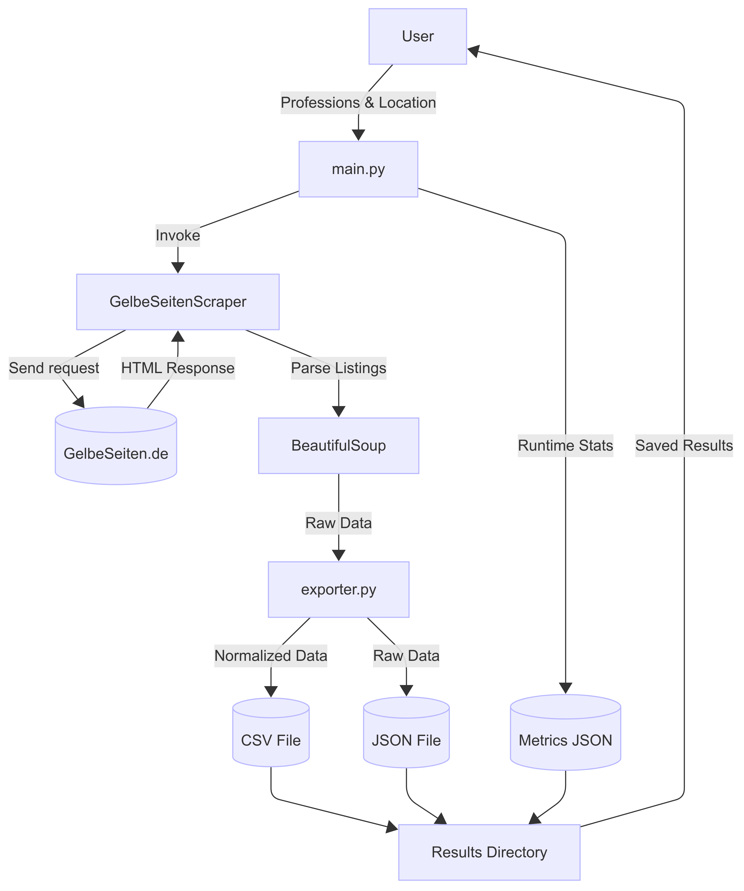
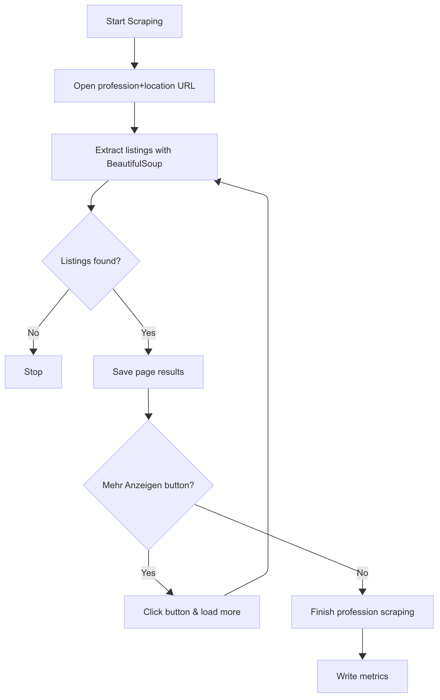

# GelbeSeiten Scraper

---

## 1. Overview

The scraper automates the extraction of business listings from **GelbeSeiten.de**.
It uses **Selenium** to load and paginate listings and **BeautifulSoup** for parsing HTML content.
Extracted data is transformed into structured formats (CSV/JSON) and summarized in a **metrics file** for evaluation.

---

## 2. Architecture

### 2.1 Module Structure

- **`scraper.py`**
  - `GelbeSeitenScraper` class
  - Manages Selenium WebDriver lifecycle
  - Handles page loading, HTML parsing, pagination, and data extraction

- **`main.py`**
  - Command-line entry point
  - Reads CLI arguments (professions, location)
  - Orchestrates scraping for multiple professions
  - Collects runtime metrics and saves them as JSON

- **`exporter.py`**
  - Data transformation and export utilities
  - Parses addresses into `street`, `postal_code`, and `city`
  - Exports data to **CSV** (normalized format) and **JSON** (raw format)

- **`test_scraper.py`**
  - Unit tests with `pytest`
  - Uses **DummyDriver** and **sample HTML** to simulate Selenium output
  - Tests parsing logic and empty results handling

### 2.2 Component Interaction



---

## 3. Data Flow Diagram (DFD)

### 3.1 Level 1 (High-Level)



### 3.2 Level 2 (Scraping Workflow)



---

## 4. Data Model

### 4.1 Listing Data (JSON)

Each listing is represented as a dictionary:

```json
{
  "name": "Dr. Olsen Schewtschenko Kanzlei für Arbeitsrecht",
  "profession": "rechtsanwalt",
  "location": "München",
  "address": "Sonnenstr. 32, 80331 München (Ludwigsvorstadt)",
  "phone": "089 21 54 89 40",
  "rating": "4,9",
  "reviews": "212 Bewertungen",
  "category": "Rechtsanwälte",
  "website": null
}

```
### 4.2 Listing Data (CSV)

In addition to JSON, listings are exported in CSV format with normalized fields.

```CSV
name,profession,street,postal_code,city,telephone,website
Dr. Olsen Schewtschenko Kanzlei für Arbeitsrecht,rechtsanwalt,Sonnenstr. 32,80331,München,089 21 54 89 40
```

### 4.3 Metrics Data

The scraper also generates a metrics_<location>.json file summarizing the run:
```Json
{
  "location": "München",
  "professions": {
    "sanitärinstallation": {"entries": 4293, "time_sec": 203.6},
    "elektroinstallationen": {"entries": 4593, "time_sec": 216.5},
    "steuerberatung": {"entries": 44590, "time_sec": 775.6},
    "arzt": {"entries": 3720, "time_sec": 196.5},
    "rechtsanwalt": {"entries": 268263, "time_sec": 2486.4}
  },
  "totals": {
    "entries": 325459,
    "time_sec": 3878.6,
    "time_min": 64.6
  }
}
```
## 5. Error Handling

The scraper is designed to handle errors gracefully:

- **Timeouts / Missing elements:**
  - Uses `WebDriverWait` and `TimeoutException` for clickable elements.
  - If "Mehr Anzeigen" is not found, pagination stops safely.

- **Empty results:**
  - If a page has no listings, a debug message is logged and scraping continues/ends properly.

- **Invalid or missing fields:**
  - Each field (`name`, `address`, `phone`, etc.) is extracted safely.
  - Missing fields are stored as `None`.

- **Exceptions:**
  - The main scraping loop is wrapped in `try/except`.
  - All exceptions are logged via `logging.exception` without stopping the scraping of other professions.

- **Safe numeric conversion:**
  - `_safe_int` method ensures integers are parsed safely, defaulting to `0` if missing or malformed.

## 6. Testing Strategy

Testing is implemented using **pytest** and a **DummyDriver**:

- **DummyDriver:**
  - Simulates Selenium WebDriver methods (`get`, `page_source`) to test scraping without a real browser.

- **Test cases include:**
  1. **Basic listing parsing:**
     - Verifies all fields (`name`, `address`, `phone`, `website`, `rating`, `reviews`, `category`, `location`) are correctly extracted from sample HTML.
  2. **Empty page handling:**
     - Ensures scraper returns an empty list when no listings are found.
  3. **Field parsing:**
     - Confirms missing or malformed fields are safely handled (`None` assigned).

- **Metrics and CSV/JSON export:**
  - Can be verified through the exported files to ensure correct data transformation and storage.
